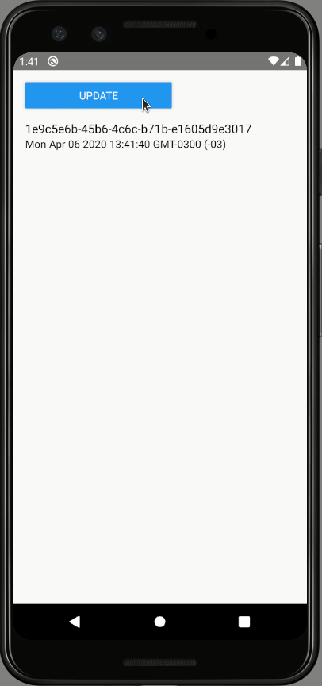

# POC: MVC Pattern

It demonstrate how to implement a screen following an approach based on [MVC](https://en.wikipedia.org/wiki/Model%E2%80%93view%E2%80%93controller) pattern. The goal here is to decouple data fetching logic from the UI by writing code based on contracts/interfaces.

## How to run

| Description | Command |
| :--- | :--- |
| Install dependencies | `npm install` |
| Run tests | `npm test` |
| Start Metro | `npm start` |
| Run app | `npm run android` |

## Preview

